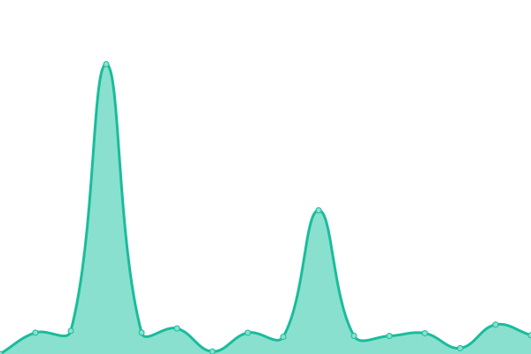
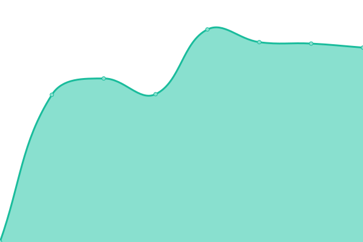
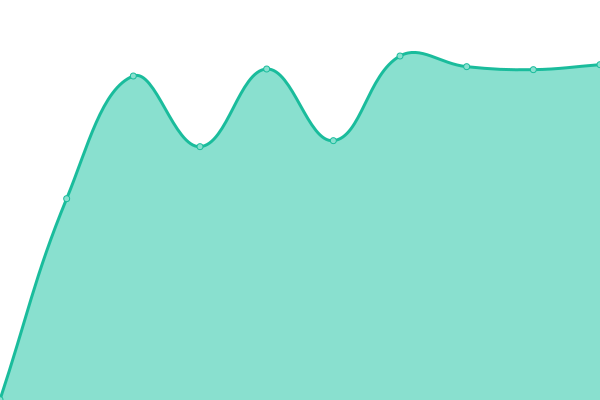

# [📈 Live Status](https://gabialabs.github.io): <!--live status--> **🟧 Partial outage**

This repository contains the open-source uptime monitor and status page for [gabialabs](https://gabialabs.github.io), powered by [Upptime](https://github.com/upptime/upptime).

With [Upptime](https://upptime.js.org), you can get your own unlimited and free uptime monitor and status page, powered entirely by a GitHub repository. We use [Issues](https://github.com/gabialabs/upptime/issues) as incident reports, [Actions](https://github.com/gabialabs/upptime/actions) as uptime monitors, and [Pages](https://gabialabs.github.io) for the status page.

<!--start: status pages-->
<!-- This summary is generated by Upptime (https://github.com/upptime/upptime) -->
<!-- Do not edit this manually, your changes will be overwritten -->
<!-- prettier-ignore -->
| URL | Status | History | Response Time | Uptime |
| --- | ------ | ------- | ------------- | ------ |
|  [Gabia.www](https://www.gabia.com/) | 🟩 Up | [gabia-www.yml](https://github.com/gabialabs/upptime/commits/HEAD/history/gabia-www.yml) | 

 2417ms
     
 | 

<a href="https://g-check.zasfe.com/history/gabia-www">100.00%</a>
    

|  [Hiworks.www](https://hiworks.com/) | 🟩 Up | [hiworks-www.yml](https://github.com/gabialabs/upptime/commits/HEAD/history/hiworks-www.yml) | 

 1020ms
     
 | 

<a href="https://g-check.zasfe.com/history/hiworks-www">100.00%</a>
    

|  [Gabia.cloud](https://cloud.gabia.com/) | 🟩 Up | [gabia-cloud.yml](https://github.com/gabialabs/upptime/commits/HEAD/history/gabia-cloud.yml) | 

 1805ms
     
 | 

<a href="https://g-check.zasfe.com/history/gabia-cloud">100.00%</a>
    

|  [Gabia.gcloudconsole](https://gcloud.gabia.com/) | 🟩 Up | [gabia-gcloudconsole.yml](https://github.com/gabialabs/upptime/commits/HEAD/history/gabia-gcloudconsole.yml) | 

 836ms
     
 | 

<a href="https://g-check.zasfe.com/history/gabia-gcloudconsole">100.00%</a>
    

|  [Gabia.orggcloudconsole](https://orgcloud.gabia.com/login) | 🟩 Up | [gabia-orggcloudconsole.yml](https://github.com/gabialabs/upptime/commits/HEAD/history/gabia-orggcloudconsole.yml) | 

 921ms
     
 | 

<a href="https://g-check.zasfe.com/history/gabia-orggcloudconsole">100.00%</a>
    

|  [gabia DNS1 - ns.gabia.co.kr](ns.gabia.co.kr) | 🟩 Up | [gabia-dns-1-ns-gabia-co-kr.yml](https://github.com/gabialabs/upptime/commits/HEAD/history/gabia-dns-1-ns-gabia-co-kr.yml) | 

 164ms
     
 | 

<a href="https://g-check.zasfe.com/history/gabia-dns-1-ns-gabia-co-kr">100.00%</a>
    

|  [gabia DNS2 - ns1.gabia.co.kr](ns1.gabia.co.kr) | 🟩 Up | [gabia-dns-2-ns1-gabia-co-kr.yml](https://github.com/gabialabs/upptime/commits/HEAD/history/gabia-dns-2-ns1-gabia-co-kr.yml) | 

 174ms
     
 | 

<a href="https://g-check.zasfe.com/history/gabia-dns-2-ns1-gabia-co-kr">100.00%</a>
    

|  [gabia DNS3 - ns.gabia.net](ns.gabia.net) | 🟩 Up | [gabia-dns-3-ns-gabia-net.yml](https://github.com/gabialabs/upptime/commits/HEAD/history/gabia-dns-3-ns-gabia-net.yml) | 

 160ms
     
 | 

<a href="https://g-check.zasfe.com/history/gabia-dns-3-ns-gabia-net">100.00%</a>
    

|  [Gabia.mornitoring.Zenius7](https://zenius7.gabia.com/zenius7/login.zenius?_m=loginPage) | 🟩 Up | [gabia-mornitoring-zenius7.yml](https://github.com/gabialabs/upptime/commits/HEAD/history/gabia-mornitoring-zenius7.yml) | 

 1154ms
     
 | 

<a href="https://g-check.zasfe.com/history/gabia-mornitoring-zenius7">100.00%</a>
    

|  [Gabia.mornitoring.Zenius72](https://zenius72.gabia.com/zenius7/login.zenius?_m=loginPage) | 🟩 Up | [gabia-mornitoring-zenius72.yml](https://github.com/gabialabs/upptime/commits/HEAD/history/gabia-mornitoring-zenius72.yml) | 

 1820ms
     
 | 

<a href="https://g-check.zasfe.com/history/gabia-mornitoring-zenius72">100.00%</a>
    

|  [Gabia.mornitoring.Zenius73](https://zenius73.gabia.com/zenius7/login.zenius?_m=loginPage) | 🟩 Up | [gabia-mornitoring-zenius73.yml](https://github.com/gabialabs/upptime/commits/HEAD/history/gabia-mornitoring-zenius73.yml) | 

 1162ms
     
 | 

<a href="https://g-check.zasfe.com/history/gabia-mornitoring-zenius73">100.00%</a>
    

|  [Gabia.mornitoring.Zenius82](https://zenius82.gabia.com/zenius8/login.zenius?_m=loginPage) | 🟥 Down | [gabia-mornitoring-zenius82.yml](https://github.com/gabialabs/upptime/commits/HEAD/history/gabia-mornitoring-zenius82.yml) | 

 0ms
     
 | 

<a href="https://g-check.zasfe.com/history/gabia-mornitoring-zenius82">100.00%</a>
    

|  [Gabia.mornitoring.Zenius8](https://zenius8.gabia.com/zenius8/login.zenius?_m=loginPage) | 🟥 Down | [gabia-mornitoring-zenius8.yml](https://github.com/gabialabs/upptime/commits/HEAD/history/gabia-mornitoring-zenius8.yml) | 

 0ms
     
 | 

<a href="https://g-check.zasfe.com/history/gabia-mornitoring-zenius8">100.00%</a>
    

|  [kns.kornet.net DNS 1](168.126.63.1) | 🟩 Up | [kns-kornet-net-dns-1.yml](https://github.com/gabialabs/upptime/commits/HEAD/history/kns-kornet-net-dns-1.yml) | 

 159ms
     
 | 

<a href="https://g-check.zasfe.com/history/kns-kornet-net-dns-1">100.00%</a>
    

|  [kns2.kornet.net DNS 2](168.126.63.2) | 🟩 Up | [kns2-kornet-net-dns-2.yml](https://github.com/gabialabs/upptime/commits/HEAD/history/kns2-kornet-net-dns-2.yml) | 

 159ms
     
 | 

<a href="https://g-check.zasfe.com/history/kns2-kornet-net-dns-2">100.00%</a>
    

|  [ns.lgtelecom.com DNS 1](164.124.101.2) | 🟩 Up | [ns-lgtelecom-com-dns-1.yml](https://github.com/gabialabs/upptime/commits/HEAD/history/ns-lgtelecom-com-dns-1.yml) | 

 161ms
     
 | 

<a href="https://g-check.zasfe.com/history/ns-lgtelecom-com-dns-1">100.00%</a>
    

|  [ns1.lgtelecom.com DNS 2](164.124.101.31) | 🟩 Up | [ns1-lgtelecom-com-dns-2.yml](https://github.com/gabialabs/upptime/commits/HEAD/history/ns1-lgtelecom-com-dns-2.yml) | 

 160ms
     
 | 

<a href="https://g-check.zasfe.com/history/ns1-lgtelecom-com-dns-2">100.00%</a>
    

|  [bns1.hananet.net DNS 1](210.220.163.82) | 🟩 Up | [bns1-hananet-net-dns-1.yml](https://github.com/gabialabs/upptime/commits/HEAD/history/bns1-hananet-net-dns-1.yml) | 

 158ms
     
 | 

<a href="https://g-check.zasfe.com/history/bns1-hananet-net-dns-1">100.00%</a>
    

|  [bns2.hananet.net DNS 2](219.250.36.130) | 🟩 Up | [bns2-hananet-net-dns-2.yml](https://github.com/gabialabs/upptime/commits/HEAD/history/bns2-hananet-net-dns-2.yml) | 

 159ms
     
 | 

<a href="https://g-check.zasfe.com/history/bns2-hananet-net-dns-2">100.00%</a>
    

|  [dns.msftncsi.com DNS 1](1.1.1.1) | 🟩 Up | [dns-msftncsi-com-dns-1.yml](https://github.com/gabialabs/upptime/commits/HEAD/history/dns-msftncsi-com-dns-1.yml) | 

 5ms
     
 | 

<a href="https://g-check.zasfe.com/history/dns-msftncsi-com-dns-1">100.00%</a>
    

|  [one.one.one.one DNS 1](1.0.0.1) | 🟩 Up | [one-one-one-one-dns-1.yml](https://github.com/gabialabs/upptime/commits/HEAD/history/one-one-one-one-dns-1.yml) | 

 6ms
     
 | 

<a href="https://g-check.zasfe.com/history/one-one-one-one-dns-1">100.00%</a>
    

<!--end: status pages-->

[**Visit our status website →**](https://gabialabs.github.io)

## 📄 License

- Powered by: [Upptime](https://github.com/upptime/upptime)
- Code: [MIT](./LICENSE) © [Anand Chowdhary](https://anandchowdhary.com), supported by [Pabio](https://pabio.com)
- Data in the `./history` directory: [Open Database License](https://opendatacommons.org/licenses/odbl/1-0/)
